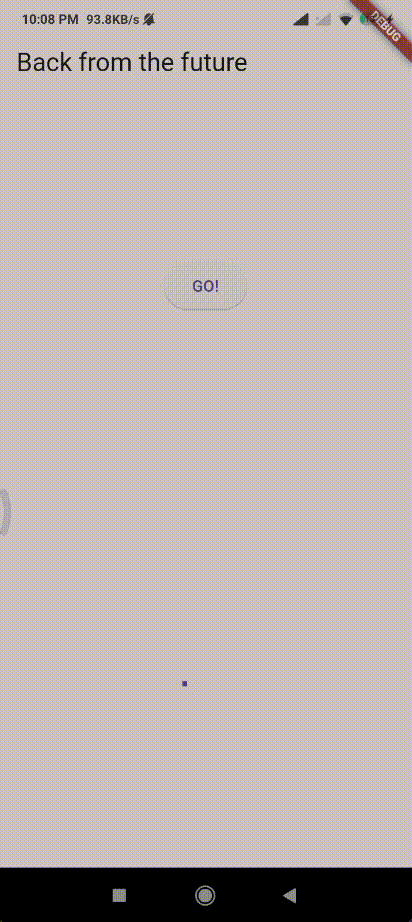

# **Pemrograman Mobile Pertemuan Minggu 10**

| Nama  :   | Haidar Aly |
| :--------: | :-------: |

| Kelas :  | TI-3F    |
| :--------: | :-------: |

| Absen : |  09  |
| :--------: | :-------: |

| NIM   :  | 2241720258   |
| :--------: | :-------: |

## Praktikum 1

### Soal 1 - Tambahkan **nama panggilan Anda** pada `title` app sebagai identitas hasil pekerjaan Anda.
>```dart
>import 'package:flutter/material.dart';
>
>void main() {
>  runApp(const MyApp());
>}
>
>class MyApp extends StatelessWidget {
>  const MyApp({Key? key}) : super(key: key);
>
>  @override
>  Widget build(BuildContext context) {
>    return MaterialApp(
>      title: 'Flutter Demo Haidar',
>      theme: ThemeData(
>        primarySwatch: Colors.blue,
>        visualDensity: VisualDensity.adaptivePlatformDensity,
>      ),
>      home: const FuturePage(),
>    );
>  }
>}
>
>class FuturePage extends StatefulWidget {
>  const FuturePage({Key? key}) : super(key: key);
>
>  @override
>  State<FuturePage> createState() => _FuturePageState();
>}
>
>class _FuturePageState extends State<FuturePage> {
>  String result = '';
>
>  @override
>  Widget build(BuildContext context) {
>    return Scaffold(
>      appBar: AppBar(
>        title: const Text('Back from the future'),
>      ),
>      body: Center(
>        child: Column(children: [
>          const Spacer(),
>          ElevatedButton(
>            child: const Text('GO!'),
>            onPressed: () {},
>          ),
>          const Spacer(),
>          Text(result),
>          const Spacer(),
>          const CircularProgressIndicator(),
>          const Spacer(),
>        ]),
>      ),
>    );
>  }
>}
>```

### Soal 2 - Carilah judul buku favorit Anda di Google Books, lalu ganti ID buku pada variabel path di kode tersebut. Kemudian cobalah akses di browser URI tersebut dengan lengkap seperti ini. Jika menampilkan data JSON, maka Anda telah berhasil.
>- **Mengganti ID variabel path**
>```dart
>   Future<Response> getData() async {
>       const authority = 'www.googleapis.com';
>       const path = '/books/v1/volumes/5NomkK4EV68C';
>       Uri url = Uri.https(authority, path);
>       return http.get(url);
>   }
>```

>- **Data JSON yang ditampilkan di browser URI**
>

### Soal 3 - Jelaskan maksud kode langkah 5 tersebut terkait `substring` dan `catchError`! kemudian Capture hasil praktikum Anda berupa GIF dan lampirkan di README.
> - Kode tersebut menggunakan substring untuk mengambil 450 karakter pertama dari respons value.body. Jika terjadi kesalahan saat mengambil data, catchError akan menangkapnya dan mengatur result menjadi 'An error occurred'.

> - **Hasil praktikum berupa GIF** <br>
>

## Praktikum 2

### Soal 4 - Jelaskan maksud kode langkah 1 dan 2 tersebut! Capture hasil praktikum Anda berupa GIF
> 1. Fungsi returnOneAsync, returnTwoAsync, dan returnThreeAsync masing-masing menunggu selama 3 detik sebelum mengembalikan nilai 1, 2 dan 3.
> 2. Fungsi count mengumpulkan hasil dari ketiga fungsi tersebut secara berurutan:
> - total diinisialisasi dengan nilai 0.
> - total diisi dengan hasil dari returnOneAsync.
> - Nilai dari returnTwoAsync ditambahkan ke total.
> - Nilai dari returnThreeAsync ditambahkan ke total.
> 3. Setelah semua operasi selesai, setState dipanggil untuk memperbarui nilai result dengan total yang telah dihitung.

> - **Hasil praktikum berupa GIF** <br>
> 

## Praktikum 3

### Soal 5 - Jelaskan maksud kode langkah 2 tersebut! Capture hasil praktikum Anda berupa GIF
> - Kode tersebut digunakan untuk menunda pengembalian nilai hingga operasi asinkron selesai. Completer memungkinkan untuk mengontrol kapan Future selesai. Fungsi getNumber memulai proses dan mengembalikan Future, sementara calculate menunggu 5 detik sebelum menyelesaikan Future dengan nilai 42.

> - **Hasil praktikum berupa GIF** <br>
> 

### Soal 6 - Jelaskan maksud perbedaan kode langkah 2 dengan langkah 5-6 tersebut! Capture hasil praktikum Anda berupa GIF
> - Kode terbaru menambahkan penanganan kesalahan jika terjadi kesalahan selama penundaan, Future diselesaikan dengan error.

> - **Hasil praktikum berupa GIF** <br>
> 

## Praktikum 4

### Soal 7 - Capture hasil praktikum Anda berupa GIF
> - **Hasil praktikum berupa GIF** <br>
> 

### Soal 8 - Jelaskan maksud perbedaan kode langkah 1 dan 4!
> FutureGroup mengelola beberapa Future dan memungkinkan penambahan Future secara dinamis sebelum dipanggil close(). Future.wait langsung menunggu semua Future dalam daftar selesai dan mengembalikan hasilnya sebagai daftar.

## Praktikum 5

### Soal 9 - Capture hasil praktikum Anda berupa GIF
> - **Hasil praktikum berupa GIF** <br>
> 

### Soal 10 - Panggil method handleError() tersebut di ElevatedButton, lalu run. Apa hasilnya? Jelaskan perbedaan kode langkah 1 dan 4!
> returnError menunda 2 detik lalu melempar Exception. handleError memanggil returnError dan menangkap kesalahan, memperbarui result dengan pesan error, dan selalu mencetak 'Complete' di akhir.

> - **Hasil praktikum berupa GIF** <br>
> 

## Praktikum 5

### Soal 11 - Tambahkan nama panggilan Anda pada tiap properti title sebagai identitas pekerjaan Anda.
> ```dart
> @override
>  Widget build(BuildContext context) {
>    return Scaffold(
>      appBar: AppBar(
>        title: const Text('Current Haidar Location'),
>      ),
>      body: Center(
>        child: Text(myPosition),
>      ),
>    );
>  }
> ```

### Soal 12 - Jika Anda tidak melihat animasi loading tampil, kemungkinan itu berjalan sangat cepat. Tambahkan delay pada method getPosition() dengan kode await Future.delayed(const Duration(seconds: 3))Apakah Anda mendapatkan koordinat GPS ketika run di browser? Mengapa demikian? Capture hasil praktikum Anda berupa GIF
> - Tidak tampil karena permission untuk pengambilan lokasi hanya diperuntukkan untuk android

> - **Hasil praktikum berupa GIF** <br>
> 

## Praktikum 6

### Soal 13 - Apakah ada perbedaan UI dengan praktikum sebelumnya? Mengapa demikian?Capture hasil praktikum Anda berupa GIF
> - Ya ada, ketika proses loading, indicator loading berjalan lebih lama yaitu 3 detik, bukan 1 detik seperti sebelumnya. Ini karena penambahan delay pada method getPosition() dengan kode await Future.delayed(const Duration(seconds: 3))

> - **Hasil praktikum berupa GIF** <br>
> 

### Soal 14 - Apakah ada perbedaan UI dengan langkah sebelumnya? Mengapa demikian? Capture hasil praktikum Anda berupa GIF
> - Untuk sekarang belum ada perubahan signifikan, karena kode yang baru saja ditambahkan berguna jika terjadi error yang dimana mengembalikan nilai errornya apa.

> - **Hasil praktikum berupa GIF** <br>
> 