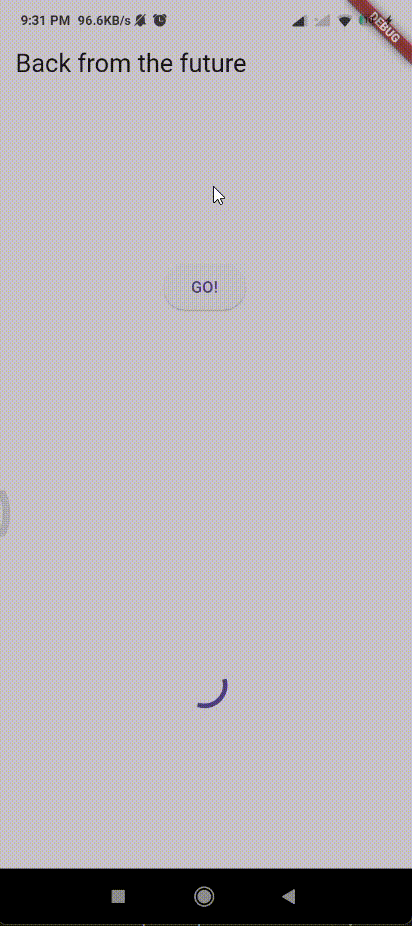

# **Pemrograman Mobile Pertemuan Minggu 10**

| Nama  :   | Haidar Aly |
| :--------: | :-------: |

| Kelas :  | TI-3F    |
| :--------: | :-------: |

| Absen : |  09  |
| :--------: | :-------: |

| NIM   :  | 2241720258   |
| :--------: | :-------: |

## Praktikum 1

### Soal 1 - Tambahkan **nama panggilan Anda** pada `title` app sebagai identitas hasil pekerjaan Anda.
>```dart
>import 'package:flutter/material.dart';
>
>void main() {
>  runApp(const MyApp());
>}
>
>class MyApp extends StatelessWidget {
>  const MyApp({Key? key}) : super(key: key);
>
>  @override
>  Widget build(BuildContext context) {
>    return MaterialApp(
>      title: 'Flutter Demo Haidar',
>      theme: ThemeData(
>        primarySwatch: Colors.blue,
>        visualDensity: VisualDensity.adaptivePlatformDensity,
>      ),
>      home: const FuturePage(),
>    );
>  }
>}
>
>class FuturePage extends StatefulWidget {
>  const FuturePage({Key? key}) : super(key: key);
>
>  @override
>  State<FuturePage> createState() => _FuturePageState();
>}
>
>class _FuturePageState extends State<FuturePage> {
>  String result = '';
>
>  @override
>  Widget build(BuildContext context) {
>    return Scaffold(
>      appBar: AppBar(
>        title: const Text('Back from the future'),
>      ),
>      body: Center(
>        child: Column(children: [
>          const Spacer(),
>          ElevatedButton(
>            child: const Text('GO!'),
>            onPressed: () {},
>          ),
>          const Spacer(),
>          Text(result),
>          const Spacer(),
>          const CircularProgressIndicator(),
>          const Spacer(),
>        ]),
>      ),
>    );
>  }
>}
>```

### Soal 2 - Carilah judul buku favorit Anda di Google Books, lalu ganti ID buku pada variabel path di kode tersebut. Kemudian cobalah akses di browser URI tersebut dengan lengkap seperti ini. Jika menampilkan data JSON, maka Anda telah berhasil.
>- **Mengganti ID variabel path**
>```dart
>   Future<Response> getData() async {
>       const authority = 'www.googleapis.com';
>       const path = '/books/v1/volumes/5NomkK4EV68C';
>       Uri url = Uri.https(authority, path);
>       return http.get(url);
>   }
>```

>- **Data JSON yang ditampilkan di browser URI**
>

### Soal 3 - Jelaskan maksud kode langkah 5 tersebut terkait `substring` dan `catchError`! kemudian Capture hasil praktikum Anda berupa GIF dan lampirkan di README.
> - Kode tersebut menggunakan substring untuk mengambil 450 karakter pertama dari respons value.body. Jika terjadi kesalahan saat mengambil data, catchError akan menangkapnya dan mengatur result menjadi 'An error occurred'.

> - **Hasil praktikum berupa GIF** <br>
>

## Praktikum 2

### Soal 4 - Jelaskan maksud kode langkah 1 dan 2 tersebut! Capture hasil praktikum Anda berupa GIF
> 1. Fungsi returnOneAsync, returnTwoAsync, dan returnThreeAsync masing-masing menunggu selama 3 detik sebelum mengembalikan nilai 1, 2 dan 3.
> 2. Fungsi count mengumpulkan hasil dari ketiga fungsi tersebut secara berurutan:
> - total diinisialisasi dengan nilai 0.
> - total diisi dengan hasil dari returnOneAsync.
> - Nilai dari returnTwoAsync ditambahkan ke total.
> - Nilai dari returnThreeAsync ditambahkan ke total.
> 3. Setelah semua operasi selesai, setState dipanggil untuk memperbarui nilai result dengan total yang telah dihitung.

> - **Hasil praktikum berupa GIF** <br>
> 